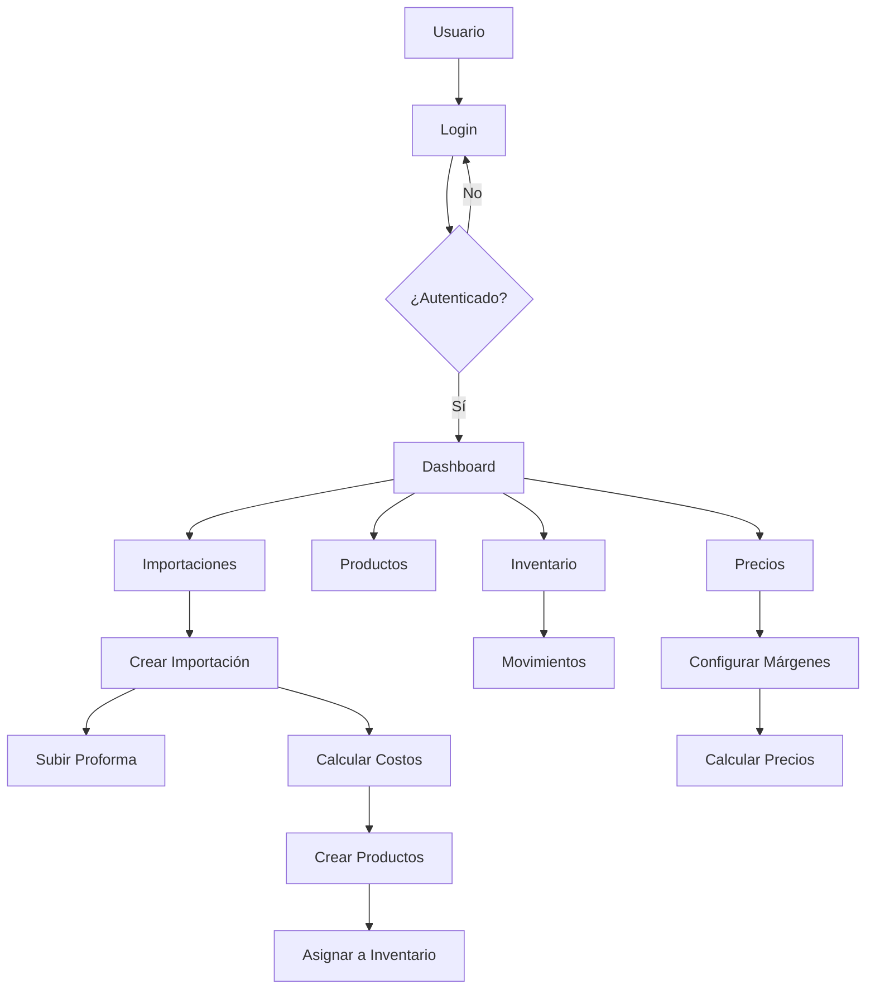

# Plan de Arquitectura: J4 Internal Manager

## Visión General
Sistema interno administrativo para Grupo Empresarial J4 S.A.S, construido con Next.js App Router, TypeScript, Tailwind CSS y Supabase.

## Stack Tecnológico
- **Frontend**: Next.js 16 (App Router), TypeScript, Tailwind CSS
- **Backend**: Supabase (Auth, PostgreSQL, Storage)
- **Deploy**: Vercel

## UI / UX
- **Dark UI moderno y profesional**
- Inspiración: dashboards SaaS premium
- Colores sobrios, buen contraste, jerarquía visual clara
- **Mobile First** (prioridad absoluta)
- **Sidebar colapsable y responsive**:
  - Desktop: sidebar fijo
  - Móvil: drawer deslizable
- **Topbar limpia**:
  - Nombre del módulo activo
  - Usuario autenticado
  - Acciones rápidas
- Componentes reutilizables
- Transiciones suaves
- Dashboard claro y legible
- Pensado para uso diario administrativo

## Datos Reales (Seed)
**Importación de ejemplo:**
- Proveedor: MHC GROUP FREE ZONE CO., LTD
- Pedido: JM-2025-3877Q
- Fecha: 2025-09-15
- Total FOB: 43,181.29 USD
- TRM: 4,100 COP
- % Importación: 40%
- Peso total: 16,238.69 KG
- Estado: En tránsito

**Productos – Acrílico Cast:**
1. Cast Acrylic Cristal 000 - 1220x2440mm - 3mm - 192 unidades - USD 24.72
2. Cast Acrylic Opal 425 - 1220x2440mm - 2.5mm - 104 unidades - USD 22.85
3. Cast Acrylic Negro 502 - 1220x2440mm - 3mm - 107 unidades - USD 26.54

**Productos – Acrílico Espejo:**
1. Espejo Dorado JM1003 - 1220x1830mm - 2.5mm - 300 unidades - USD 19.17
2. Espejo Plata JM1001 - 1220x1830mm - 2.5mm - 150 unidades - USD 19.17

**Accesorios:**
- Bisagra acrílica L30xW33 – 10,000 unidades – USD 0.10
- Bisagra acrílica L45xW38 – 10,000 unidades – USD 0.16

**Distribución inicial del inventario:**
- Medellín: 40%
- Cúcuta: 30%
- Bucaramanga: 30%

## Arquitectura del Sistema

### Estructura de Directorios
```
j4/
├── app/
│   ├── (auth)/
│   │   ├── login/
│   │   └── layout.tsx
│   ├── (dashboard)/
│   │   ├── dashboard/
│   │   ├── importaciones/
│   │   ├── productos/
│   │   ├── inventario/
│   │   └── layout.tsx
│   ├── api/
│   ├── globals.css
│   ├── layout.tsx
│   └── page.tsx
├── components/
│   ├── ui/
│   ├── forms/
│   └── dashboard/
├── lib/
│   ├── supabase/
│   ├── utils/
│   └── validations/
├── types/
└── hooks/
```

### Base de Datos - Esquema PostgreSQL

#### Tablas Principales

**profiles**
- id: uuid (FK a auth.users)
- role: enum ('admin', 'operador', 'consulta')
- created_at: timestamp
- updated_at: timestamp

**branches**
- id: serial (PK)
- name: varchar(100) UNIQUE
- created_at: timestamp

**imports**
- id: serial (PK)
- supplier: varchar(255)
- total_usd: decimal(12,2)
- trm: decimal(8,2)
- import_cost_percent: decimal(5,2) DEFAULT 40
- total_cop: decimal(15,2) (calculado)
- status: enum ('en_transito', 'recibido', 'parcial')
- proforma_url: text (Supabase Storage)
- user_id: uuid (FK)
- created_at: timestamp
- updated_at: timestamp

**products**
- id: serial (PK)
- import_id: integer (FK)
- type: enum ('acrilico_cast', 'espejo', 'accesorios')
- dimensions: varchar(100)
- thickness: decimal(5,2)
- color: varchar(100)
- weight_per_unit: decimal(8,2)
- unit_cost_cop: decimal(10,2) (calculado)
- created_at: timestamp

**inventory**
- id: serial (PK)
- product_id: integer (FK)
- branch_id: integer (FK)
- quantity: integer
- created_at: timestamp
- updated_at: timestamp

**inventory_movements**
- id: serial (PK)
- product_id: integer (FK)
- from_branch_id: integer (FK, nullable)
- to_branch_id: integer (FK, nullable)
- quantity: integer
- type: enum ('entrada', 'salida', 'transferencia')
- user_id: uuid (FK)
- created_at: timestamp

**prices**
- id: serial (PK)
- product_id: integer (FK)
- margin_percent: decimal(5,2)
- suggested_price: decimal(10,2) (calculado)
- created_at: timestamp
- updated_at: timestamp

### Seguridad - Row Level Security (RLS)

**Políticas por Rol:**
- **Admin**: Acceso completo a todas las tablas
- **Operador**: CRUD en importaciones, productos, inventario; solo lectura en dashboard
- **Consulta**: Solo lectura en todas las tablas

### Autenticación y Autorización

- **Supabase Auth**: Manejo de usuarios y sesiones
- **Middleware**: Protección de rutas basada en autenticación y roles
- **Server Components**: Lógica de negocio en servidor

### Funcionalidades Clave

#### 1. Autenticación
- Login con email/password
- Redirección automática
- Logout seguro

#### 2. Importaciones
- Formulario de creación con validaciones
- Cálculo automático: total_cop = total_usd * trm * (1 + import_cost_percent/100)
- Subida de proforma a Supabase Storage
- Estados y seguimiento

#### 3. Productos
- Creación automática desde importaciones
- Cálculo de costo unitario: unit_cost_cop = total_cop / cantidad_total_productos

#### 4. Inventario
- Asignación inicial desde importaciones
- Movimientos entre sedes
- Historial completo

#### 5. Precios y Utilidad
- Configuración de márgenes
- Cálculo automático de precios sugeridos
- Simulación de utilidades

#### 6. Dashboard
- Métricas en tiempo real
- Gráficos de inventario por sede
- Resumen financiero

### Flujo de Datos



### Próximos Pasos
1. Instalar dependencias de Supabase
2. Configurar cliente y tipos
3. Crear migraciones SQL
4. Implementar autenticación
5. Desarrollar módulos por prioridad

### Consideraciones de Escalabilidad
- Diseño normalizado para futuras expansiones
- Server Actions para lógica crítica
- Optimización de consultas con índices
- Preparación para módulos futuros (ventas, facturación, etc.)